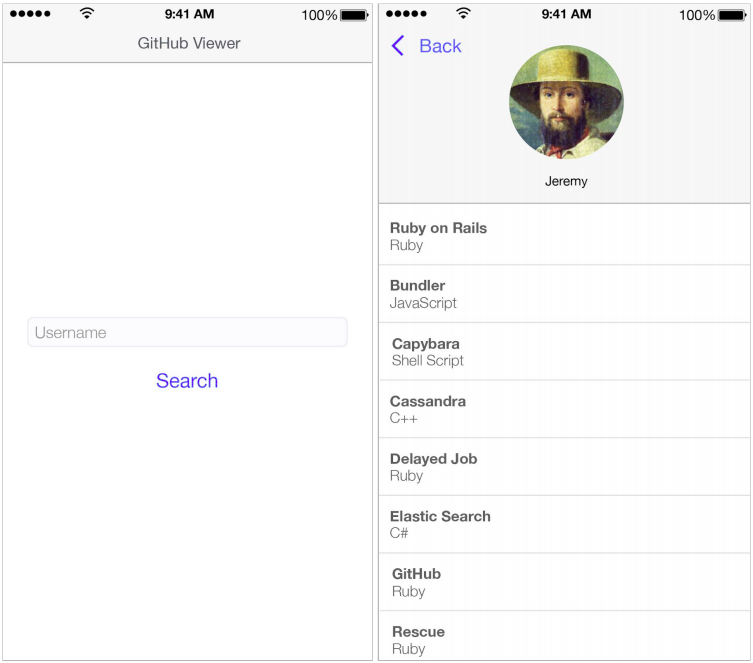

//
// Prerequisites & Installation (https://github.com/asciidoctor/asciidoctor-pdf):
// 
//   ruby 2.0.0+
//   prawn 2.0.0+
//   asciidoctor
//   asciidoctor-pdf 1.5.0.alpha.10
// 
// Build the document:
//
// HTML5
//   $ asciidoctor -b html5 README.adoc
//
// PDF
//   $ asciidoctor-pdf README.adoc
//
= Agile Contents Swift iOS code challenge README

:doctype: book
:lang: en
:listing-caption: Listing

== Code challenge

The purpose of the test is to validate your technical and organizational skills. It’s not a big
deal if you can’t finish it, we prefer to have an incomplete clean and functional code than a 
badly organized and “ugly” code. It's OK if you set a maximum duration to the challenge.

The application should be developed using Xcode Swift 4 or superior for iOS. Apart from that, it's
up to you how you structure the code and what libraries you use.

This repository is dedicated to your code challenge, you are free to use it as it suits you. The
only requirement is that all the code must be available in the master branch once you have
finished. You can also edit this document if you want to incluide any information, like build and
running instructions, that would be useful to us.

Take into account that, after you finish the code challenge, we will review it and maybe we will ask
you to perform a code review together, just to learn a bit about the project and code structure.

IMPORTANT: We would be glad to answer any questions or hear any suggestions about the code
challenge, so don't hesitate to ask. 

=== Objective

The application to develop has to allow the user to search and display a GitHub profile. Including
the profile name, photo, repositories and their programming languages.

The API for making calls is available at the following URL: 
https://api.github.com/users/[username]/repos

=== Features

* Home screen: omposed of a text box, where the profile name should be entered, and a button to
perform the search, whose result should be displayed in the profile detail screen.
* Profile detail: this screen should display the profile name and photo (if it is found) and a
list with all its the repositories. This list should present the name of the repository and, in
the subtitle of each item, its programming language. A back button should allow you to return to
the home screen to perform a new search.
* Error handling: when any error occurs in the API call, the following message should be displayed:
"A network error has occurred. Check your Internet connection and try again later.". 
This message should have an "OK" button that just closes it.
* User not found: if a user is not found, display the following message: _"User not found. Please 
enter another name."_. This message should have an _"OK"_ button that just closes it.

As an extra optional feature (only if you are done with the previous features) or depending on if you use TDD:

* Unit tests.

=== Requirements

* Follow as closely as possible the reference layout provided in this document.
* Layout should fit any screen size, including tablet. For this it is enough to maintain the 
alignment of the elements.

=== Considerations

In addition to the implementation of all functionalities and requirements, the following aspects of
the solution will be taken into account:

* Clarity and organization of the code and files.
* Testability.
* Maintainability.
* Performance.

